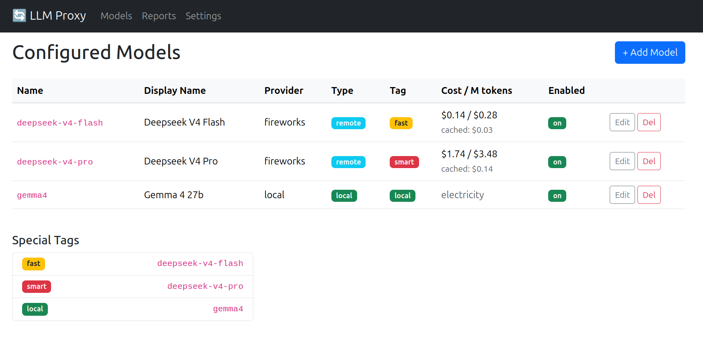

# 🔄 LLM Proxy — Web UI + OpenAI-Compatible API

A lightweight proxy that sits between your AI clients and any number of
LLM backends. It presents an OpenAI-compatible API while rewriting model
names, tracking token usage and cost, and providing automatic fallback
between fast ↔ smart models.

Comes with a **web dashboard** for managing models, viewing cost charts,
and tweaking settings — no config files to hand-edit after initial setup.

---

## ✨ Features

- **Web UI** — Add, edit, and delete model backends through your browser. Manage fast/smart/local tags, view the dashboard at a glance.
- **OpenAI-compatible API** — Drop-in replacement at `/v1/chat/completions` and `/v1/models`.
- **Arbitrary backends** — Configure as many remote and local models as you want, each with its own URL, API key, model name, and pricing.
- **Tag-based routing** — Tag one model as `fast`, one as `smart`, one as `local`. Request `"model": "fast"` to hit your cheap model, or use any specific model name.
- **Automatic fallback** — If a `fast`-tagged model fails (server error / timeout / rate limit), the proxy retries on the `smart` model, and vice versa.
- **Local model support** — Run models on your own hardware. Cost is calculated from wattage × electricity price instead of token pricing.
- **Streaming support** — SSE streaming works out of the box.
- **Usage tracking & charts** — Per-model, per-day token counts and dollar costs, with matplotlib bar charts on the `/reports` page.
- **Persistent storage** — All config and usage data lives in `data/*.bson` via [moofile](https://github.com/patw/moofile).



---

## 🚀 Quick Start

### 1. Install dependencies

```bash
./ubuntu-install.sh
```

This installs system packages and pip packages (moofile needs `--break-system-packages` on modern Ubuntu).

If you prefer pip/uv directly:

```bash
pip install -r requirements.txt --break-system-packages
# or: uv pip install -r requirements.txt
```

### 2. Configure the server

Copy `.env.example` to `.env`:

```bash
cp .env.example .env
```

Edit `.env` — the only required settings are:

```ini
PROXY_PORT=8086
BIND_HOST=0.0.0.0
FLASK_SECRET_KEY=change-me-to-something-random
```

### 3. Run

```bash
./start.sh
```

Then open **http://localhost:8086/** and add your first model through the
web UI.  No manual config file editing — just fill in the form.

---

## ⚙️ Configuration

All server config lives in `.env`:

| Variable | Description | Default |
|---|---|---|
| `PROXY_PORT` | Port the proxy + web UI listens on | `8086` |
| `BIND_HOST` | IP to bind to (use LAN IP to avoid WAN exposure, `0.0.0.0` for all) | `0.0.0.0` |
| `FLASK_SECRET_KEY` | Flask session cookie secret — change this! | — |

Everything else — models, API keys, pricing — is managed through the Web UI
at **http://localhost:8086/** and persisted automatically in `data/models.bson`.

### Model fields

When adding a model through the UI:

| Field | Description |
|---|---|
| **Name** | Short unique identifier (used as `"model"` in API requests) |
| **Display Name** | Human-readable label |
| **Provider** | Label for display (e.g. `fireworks`, `openai`, `local`) |
| **Type** | `remote` (token pricing) or `local` (electricity pricing) |
| **Tag** | Optional: `fast`, `smart`, or `local` — at most one model per tag |
| **Base URL** | Backend base URL |
| **API Key** | Auth key for the backend (leave empty for local models) |
| **API Model Name** | Model name to send to the backend |
| **Pricing** | Per-million-token prices for input, output, and cached tokens |
| **Enabled** | Toggle on/off without deleting |

### Tag behavior

- **`fast`** — your cheap/quick model. Falls back to `smart` on error.
- **`smart`** — your capable/slow model. Falls back to `fast` on error.
- **`local`** — a model running on your own hardware. No fallback.

If you only have one model, tag it `fast` and leave `smart` unassigned —
fallback will be disabled automatically.

---

## 📡 API Usage

Once running, point any OpenAI-compatible client at the proxy:

```bash
# Use the fast model (auto-fallback to smart on error)
curl http://localhost:8086/v1/chat/completions \
  -H "Content-Type: application/json" \
  -d '{
    "model": "fast",
    "messages": [{"role": "user", "content": "Tell me a joke!"}]
  }'

# Use the smart model for heavier tasks
curl http://localhost:8086/v1/chat/completions \
  -H "Content-Type: application/json" \
  -d '{
    "model": "smart",
    "messages": [{"role": "user", "content": "Write a detailed analysis of..."}]
  }'

# Use a specific model by its configured name
curl http://localhost:8086/v1/chat/completions \
  -H "Content-Type: application/json" \
  -d '{
    "model": "deepseek-v4-flash",
    "messages": [{"role": "user", "content": "Hello!"}]
  }'

# List available models
curl http://localhost:8086/v1/models
```

> **Note:** The proxy does **not** validate incoming `Authorization` headers —
> it replaces them with the backend's configured API key. Unrecognized model
> names return a 400 error.

---

## 📊 Reports

Visit **http://localhost:8086/reports** for:

- **Daily token spend** — bar chart of cost per day (last 30 days)
- **Monthly token spend** — bar chart of cost per month
- **Cost per model** — horizontal bar chart breakdown
- **Token volume** — stacked bar chart of input vs output tokens per day
- **Summary tables** — today / this week / this month totals, per-model breakdown

Costs for remote models are calculated from per-million-token pricing. Costs
for local models use `wattage × duration × electricity price`.

---

## ⚙️ Settings

Visit **http://localhost:8086/settings** to configure:

| Setting | Default | Description |
|---|---|---|
| Electricity Cost | $0.12/kWh | Used for local model cost calculations |
| Max Wattage | 300W | Estimated power draw of your local model hardware |

---

## 📁 Data Storage

All data lives in `data/` as [moofile](https://github.com/patwendorf/moofile) BSON files:

| File | Contents |
|---|---|
| `data/models.bson` | All configured models |
| `data/usage.bson` | Per-model, per-day token & cost records |
| `data/settings.bson` | Global settings |

---

## 🧱 Dependencies

| Package | Purpose |
|---|---|
| `flask` | Web UI + proxy server |
| `httpx` | HTTP client for forwarding requests to backends |
| `python-dotenv` | Load `.env` config |
| `moofile` | Embedded BSON document store |
| `matplotlib` | Cost & usage charts on the reports page |

---

## 🛡️ Security

- **Never commit `.env` or `data/` to git.** `.env` contains your Flask
  secret; `data/` contains API keys in plain text BSON.
- **Keep this on localhost or behind a firewall/VPN.** The proxy does not
  authenticate clients — it replaces whatever `Authorization` they send
  with the backend's key.
- **Use `BIND_HOST` to lock down exposure.** Set it to your LAN IP if
  running on a multi-interface machine.

---

## 📄 License

MIT — do whatever you want with it.
